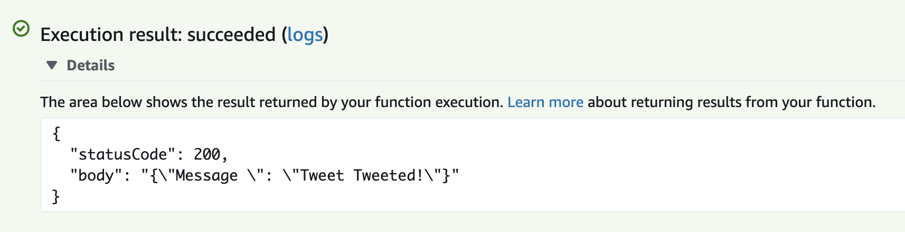
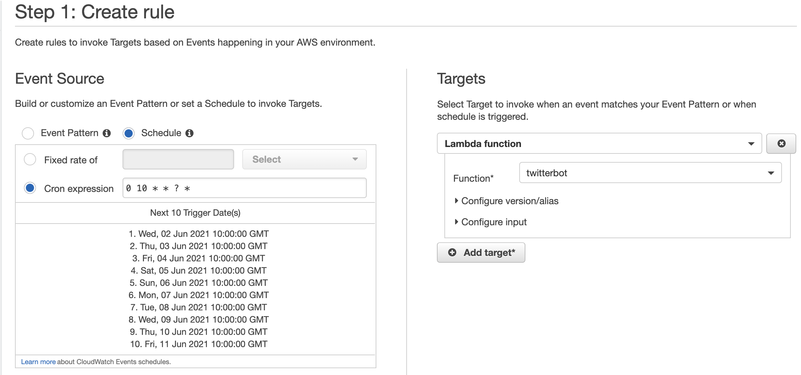

# Creating a Twitter bot in Python and let it move into AWS.

I've wanted to try out Twitter's API and create a Twitter bot for a while, but I lacked a use case for it. But last week, I found a perfect use case for my Twitter bot. 

I live in Gothenburg and this city is known as "Little London" because of how often it rains here. When it rains too much, commonly, some football fields around the city become unplayable. Currently, there is a webpage that gets updated daily with the statuses of the fields. One has to go to that webpage to check if the field of interest is playable or not. My Twitter bot will fetch data from this page and tweet a list of the unplayable fields three times a day. The Twitter bot will be developed in Python and deployed as a Lambda function in AWS.

## Prerequisite
Before I start, there are a few prerequisites to set up. 
1. First, I need a Twitter account for the bot, create one [here](https://twitter.com/i/flow/signup?). 
2. Once I have a Twitter account, I need to create a Twitter Developer Account. It is possible to apply for access here [here](https://developer.twitter.com/en). I link the Developer Account with my Twitter account to gain access to the API keys and secrets.
3.  I need to create a **Project** in the Twitter Developer Portal and then create an **App** inside the **Project**.
4. On the App overview, I made sure to set the correct permissions. The needed **API Keys** and **API Tokens** is then available under the **Keys and Token Tab**. Below is how it looks for me:

<figure>

</figure>
5. The last thing I need to set up is an AWS account, which I did [here](https://portal.aws.amazon.com/billing/signup#/start).

## Coding the bot

### Set up the environment
As always, when I develop using Python, I prefer working in [virtual environments](https://docs.python.org/3/library/venv.html). 

I start by: 
```bash
$ python3 -m venv venv
# On Unix
$ source venv/bin/activate
```

I also create an empty `requirements.txt` file since I know that we will use external dependencies.

### Getting the data for the Tweet
Finally, I can go ahead with the fun stuff. There is no available **API** for the data I want my bot to tweet out. The only option is to write some logic that collects the wanted data from the HTML page itself. My first idea was to parse the HTML using some Regex, but my colleague showed me [this](https://stackoverflow.com/questions/1732348/regex-match-open-tags-except-xhtml-self-contained-tags) awesome answer on Stackoverflow. So... I decided to go with **BeautifulSoup**, which is a Python library for pulling data out of HTML. Since the football fields information is inside **span** tags, I use the `find_all("span")` function to find them all. I read the corresponding **style** for each football field and checked whether the background color was RED (unplayable) or GREEN (playable). In the end, I store the data in a **dict** with fields as key and statuses as value. I need to do some filtering and cleaning to get rid of unwanted data. *The finalized code is available at [Github](https://github.com/mile95/gbg-field-status-bot).*

```python
IGNORED_SPANS = [
    "CENTRUM",
    "NORDOST",
    "VÄSTER",
    "HISINGEN",
]
VALID_COLORS = ["#00ff00", "#ffffff", "ff0000"]
URL = "https://bok.goteborg.se/ShowNews.action;jsessionid=8B8D19B5301F646B425B26EF4E1874D6?id=285"
def collect_statuses_from_webpage() -> dict:
    html_data = requests.get(URL).text
    soup = BeautifulSoup(html_data)
    fields = {}
    for span in soup.find_all("span"):
        text = span.text.replace("\xa0", "")
        style = span.get("style")
        if (
            re.search("[a-zA-Z]", text)
            and style
            and any(color in style for color in VALID_COLORS)
            and not any(filter_span in text for filter_span in IGNORED_SPANS)
        ):
            fields[text] = "GREEN" if "#00ff00" in style else "RED"
    return fields
  
print(collect_statuses_from_webpage())
```
```
# requirements.txt
requests
bs4
lxml
```
To run the above scripts, I do:

```bash
(venv) $ pip install -r requirements.txt
(venv) $ python lambda_function.py
{
   'Angered Arena (Angeredsvallen), Gräs 11m': 'GREEN',
   'Apelsinplan, Gräs 11m': 'GREEN',
   'Bergsjövallen, Gräs 11m': 'GREEN',
   'Bergumsvallen, Gräs 11m': 'GREEN',
   'Gamlestadsvallen, Gräs 11m': 'GREEN',
   'Hovgårdsvallen, Gräs 11m': 'RED',
   'Hovåsvallen, Gräs 11m': 'GREEN',
   'Klarebergsvallen, Gräs 11m': 'GREEN',
   'Kvibergs idrottsområde 7-12': 'GREEN',
   ...
 }
```
### Connect to the Twitter account using Tweepy
Now that I managed to fetch the data, it is time for me to make sure that the bot can tweet it. Using Twitter's API is a piece of cake if you use the Python library **Tweepy**. Accessing Twitter's API and post a tweet only requires **4** rows of python code. 

I need to add **Tweepy** to the requierements.txt
```
# requirements.txt
requests
bs4
lxml
tweepy
```
I then need to add the developer keys and token (as in point 4 in prerequisites above) in the python script.
  ```python
# Twitter authentication
ACCESS_TOKEN_SECRET = "..."
ACCESS_TOKEN = "..."
CONSUMER_API_KEY = "..."
CONSUMER_API_SECRET = "..."
  ```
I now have everything I need to connect to my Twitter account and post a "Hello Twitter!" tweet. 

```python
import tweepy
 
auth = tweepy.OAuthHandler(CONSUMER_API_KEY, CONSUMER_API_SECRET)
auth.set_access_token(ACCESS_TOKEN, ACCESS_TOKEN_SECRET)
API = tweepy.API(auth)
API.update_status("Hello Twitter!")
```

## Final preperations before the bot leaves home and grows up
I will deploy the Twitter bot to AWS as a Lambda Function. In AWS, Lambda Functions are often deployed as `.zip` files. By definition, a Lambda Function is a self-contained block of functionality, this means that I will have to package my python script together with all the required dependencies. But before I do that, there are two things that can be good to know:

- For AWS Lambda Functions in **Python**, the entrypoint method needs to be declared as in a file called `lambda_function.py` and with the name and signature as below. When the Lambda is being triggered, the `lambda_handler` method will be executed. 
  ```python
  # lambda_function.py
  def lambda_handler(event, context):
      # TODO
      return {
          "statusCode": 200, 
          "body": json.dumps({"Response ": "Execution of Lambda went well!"})
      }
  ```
- It is bad practice to store credentials in plain text directly in the source code, especially if you plan to open-source the code. It is possible to set environment variables for the execution environment for a lambda function and read the environment variables from the script.


The `lambda_function.py` looked like this before deployment:
```python
from typing import List
import tweepy
from bs4 import BeautifulSoup
import requests
import re
import datetime
import json
from os import environ

# Twitter authentication
ACCESS_TOKEN_SECRET = environ["ACCESS_TOKEN_SECRET"]
ACCESS_TOKEN = environ["ACCESS_TOKEN"]
CONSUMER_API_KEY = environ["CONSUMER_API_KEY"]
CONSUMER_API_SECRET = environ["CONSUMER_API_SECRET"]

URL = "https://bok.goteborg.se/ShowNews.action;jsessionid=8B8D19B5301F646B425B26EF4E1874D6?id=285"
IGNORED_SPANS = [
    "CENTRUM",
    "NORDOST",
    "VÄSTER",
    "HISINGEN",
]
VALID_COLORS = ["#00ff00", "#ffffff", "ff0000"]

# Create access to Twitter API
auth = tweepy.OAuthHandler(CONSUMER_API_KEY, CONSUMER_API_SECRET)
auth.set_access_token(ACCESS_TOKEN, ACCESS_TOKEN_SECRET)
API = tweepy.API(auth)

def collect_statuses_from_webpage() -> dict:
    html_data = requests.get(URL).text
    soup = BeautifulSoup(html_data)
    fields = {}
    for span in soup.find_all("span"):
        text = span.text
        text = text.replace("\xa0", " ")
        style = span.get("style")
        if (
            re.search("[a-zA-Z]", text)
            and style
            and any(color in style for color in VALID_COLORS)
            and not any(filter_span in text for filter_span in IGNORED_SPANS)
        ):
            fields[text] = "GREEN" if "#00ff00" in style else "RED"
    return fields


def tweet_statuses(closed_fields):
    time = datetime.datetime.utcnow().strftime("%Y-%m-%d %H:%M")
    tweet_text = f"Update: {time} \n\n"
    if not closed_fields:
        tweet_text += "All fields are playable! ✅"
    else:
        for field in closed_fields:
            tweet_text += f"{field} ❌ \n"
    API.update_status(tweet_text)

def lambda_handler(event, context):
    statuses = collect_statuses_from_webpage()
    closed_fields = [field for field, status in statuses.items() if status == "RED"]
    tweet_statuses(closed_fields)
    return {"statusCode": 200, "body": json.dumps({"Message ": "Tweet Tweeted!"})}

```

Now that I'm done with `lambda_function.py`, I package the script with all required dependencies into a single zip file.

I start by installing the dependencies into the current directory using the target (-t) flag for `pip install`
```bash
pip install -r requirements.txt -t .
```

I then zip it all by (*the `-x` flag for `zip` exludes files*)
```bash
zip -r lambda.zip * -x "bin/*" requirements.txt setup.cfg
```


## AWS Deployment
It is now time to deploy the Twitter bot to AWS. 

1. I Create a new Lambda Function and select **Python 3.8** as the runtime environment.
2. In the overview of the new Lambda Function, I go to the Code tab and upload the `.zip` I created earlier.
3. I test the Lambda Function by going to the Test tab and send a new test event. If the test succeeded, I see something similar to the image below. I can also visit Twitter and verify that my bot has recently tweeted.

  
  
  
4. Now that I know that the Lambda is working as I want, there's only one thing left to do. I need to schedule trigger events for the Lambda Function. I want my bot to tweet updates daily at 10 am, 12 am, and 3 pm. I achieve this by using the **CloudWatch** AWS service. In the left column of the CloudWatch page, I go to **Events**, then **Rules** and finally **Create rule**. In the first step of the rule creation, I select **Schedule** and I then insert `0 10 * * ? *` as the **Cron expression**. An event will now be triggered every day at 10 am. For the **Targets** in the right column, I select the Lambda Function and then finalize the rule in **Step 2**.  I repeat this for both the event at 13 am and the event at 3 pm.

My configuration looks like this: 



* * * 

That's all! Now I have a Twitter Bot up and running and,  it Tweets updated three times a day. You can find the Twitter Bot [here](https://twitter.com/gbgplanstatus), and you can find the source code for the Lambda Function [here](https://github.com/mile95/gbg-field-status-bot).

Thanks for reading, 👋! 